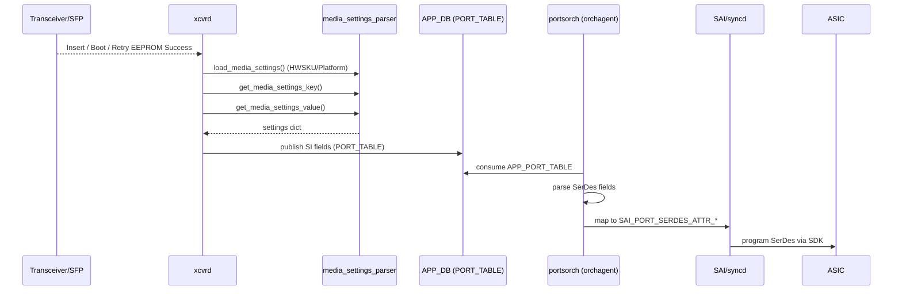

# media_settings.json End-to-End Flow (Implementation-Based)

This document captures the **runtime** media_settings.json flow as implemented in the SONiC buildimage submodules. It focuses on the **actual code paths** in `xcvrd` and `portsorch`, with the HLD used only as background context.

## 1) High-Level Flow (Implementation-Based)

```
Transceiver Insert / Boot / EEPROM Retry
     |
     v
xcvrd loads media_settings.json (HWSKU or platform)
     |
     v
xcvrd builds lookup keys (vendor/media + lane speed)
     |
     v
xcvrd finds best-match settings (GLOBAL/PORT + speed hierarchy)
     |
     v
xcvrd publishes SI settings to APP_DB PORT_TABLE
     |
     v
portsorch consumes APP_PORT_TABLE, parses SerDes fields
     |
     v
portsorch maps SerDes fields to SAI port serdes attributes
     |
     v
syncd/SDK applies SerDes configuration to ASIC
```

### Trigger points (xcvrd)
* **Boot-up posting**: during initial SFP info posting, xcvrd calls `notify_media_setting()` for each logical port (unless warm start).【F:src/sonic-platform-daemons/sonic-xcvrd/xcvrd/xcvrd.py†L308-L330】
* **Insertion event**: when a module is inserted and EEPROM read succeeds, xcvrd invokes `notify_media_setting()`.【F:src/sonic-platform-daemons/sonic-xcvrd/xcvrd/xcvrd.py†L812-L823】
* **Retry EEPROM success**: if EEPROM was not ready, once it succeeds in a later retry, xcvrd triggers `notify_media_setting()` again.【F:src/sonic-platform-daemons/sonic-xcvrd/xcvrd/xcvrd.py†L839-L851】

### Where media_settings.json is loaded
`media_settings_parser.load_media_settings()` looks in **HWSKU** first, then **platform**, and loads the JSON into memory (`g_dict`).【F:src/sonic-platform-daemons/sonic-xcvrd/xcvrd/xcvrd_utilities/media_settings_parser.py†L32-L49】

---

## 2) Sequence Diagram (Implementation-Based)



**Code references for each step**:
* `load_media_settings()` loads JSON from HWSKU/platform paths.【F:src/sonic-platform-daemons/sonic-xcvrd/xcvrd/xcvrd_utilities/media_settings_parser.py†L32-L49】
* `get_media_settings_key()` builds vendor/media/lane-speed keys.【F:src/sonic-platform-daemons/sonic-xcvrd/xcvrd/xcvrd_utilities/media_settings_parser.py†L97-L160】
* `get_media_settings_value()` performs global/port + lane-speed lookup.【F:src/sonic-platform-daemons/sonic-xcvrd/xcvrd/xcvrd_utilities/media_settings_parser.py†L193-L302】
* `notify_media_setting()` publishes to APP_DB PORT_TABLE and marks state sync status.【F:src/sonic-platform-daemons/sonic-xcvrd/xcvrd/xcvrd_utilities/media_settings_parser.py†L319-L385】
* `PortsOrch::doTask()` consumes APP_PORT_TABLE updates.【F:src/sonic-swss/orchagent/portsorch.cpp†L6178-L6221】
* `PortHelper::parsePortSerdes()` parses SerDes fields from PORT_TABLE entries.【F:src/sonic-swss/orchagent/port/porthlpr.cpp†L1080-L1238】
* `getPortSerdesAttr()` maps parsed SerDes fields to SAI attributes.【F:src/sonic-swss/orchagent/portsorch.cpp†L436-L537】

---

## 3) Detailed Code-Driven Flow (Step-by-Step)

### Step A — Key construction (xcvrd)
`get_media_settings_key()` builds:
* `vendor_key` = `VENDOR-PN`
* `media_key` = `type + compliance + length`
* `lane_speed_key` = `speed:*` (CMIS or computed)
* `medium_lane_speed_key` = `COPPER{speed}` / `OPTICAL{speed}`

These are the lookup inputs to `media_settings.json`.【F:src/sonic-platform-daemons/sonic-xcvrd/xcvrd/xcvrd_utilities/media_settings_parser.py†L97-L160】

### Step B — Lookup semantics (global/port + lane speed)
`get_media_settings_value()` handles:
* **GLOBAL_MEDIA_SETTINGS** with port ranges/lists
* **PORT_MEDIA_SETTINGS** for explicit per-port overrides
* regex matching for vendor/media keys
* speed-aware hierarchy via `get_media_settings_for_speed()`
* fallback to `Default` or `speed:Default`

【F:src/sonic-platform-daemons/sonic-xcvrd/xcvrd/xcvrd_utilities/media_settings_parser.py†L193-L302】

### Step C — Publish to APP_DB PORT_TABLE
`notify_media_setting()` converts per-lane values to comma-separated lists, builds `FieldValuePairs`, and writes into APP_DB `PORT_TABLE` for the logical port. It also updates state to indicate the SI settings were published.【F:src/sonic-platform-daemons/sonic-xcvrd/xcvrd/xcvrd_utilities/media_settings_parser.py†L319-L385】

### Step D — PortsOrch consumption and SAI translation
* `PortsOrch::doTask()` consumes `APP_PORT_TABLE_NAME` updates.【F:src/sonic-swss/orchagent/portsorch.cpp†L6178-L6221】
* `PortHelper::parsePortSerdes()` parses SerDes fields and populates `PortSerdes` structures.【F:src/sonic-swss/orchagent/port/porthlpr.cpp†L1080-L1238】
* `getPortSerdesAttr()` maps `PortSerdes` into SAI attributes (e.g., preemphasis → `SAI_PORT_SERDES_ATTR_PREEMPHASIS`).【F:src/sonic-swss/orchagent/portsorch.cpp†L436-L537】

---

## 4) Field Mapping Table (media_settings.json → APP_DB → SAI)

The table below documents the end-to-end mapping of fields based on the code.

| media_settings.json key | APP_DB PORT_TABLE field | PortOrch field constant | SAI attribute (portsorch mapping) |
|---|---|---|---|
| `preemphasis` | `preemphasis` | `PORT_PREEMPHASIS` | `SAI_PORT_SERDES_ATTR_PREEMPHASIS` |
| `idriver` | `idriver` | `PORT_IDRIVER` | `SAI_PORT_SERDES_ATTR_IDRIVER` |
| `ipredriver` | `ipredriver` | `PORT_IPREDRIVER` | `SAI_PORT_SERDES_ATTR_IPREDRIVER` |
| `pre1` | `pre1` | `PORT_PRE1` | `SAI_PORT_SERDES_ATTR_TX_FIR_PRE1` |
| `pre2` | `pre2` | `PORT_PRE2` | `SAI_PORT_SERDES_ATTR_TX_FIR_PRE2` |
| `pre3` | `pre3` | `PORT_PRE3` | `SAI_PORT_SERDES_ATTR_TX_FIR_PRE3` |
| `main` | `main` | `PORT_MAIN` | `SAI_PORT_SERDES_ATTR_TX_FIR_MAIN` |
| `post1` | `post1` | `PORT_POST1` | `SAI_PORT_SERDES_ATTR_TX_FIR_POST1` |
| `post2` | `post2` | `PORT_POST2` | `SAI_PORT_SERDES_ATTR_TX_FIR_POST2` |
| `post3` | `post3` | `PORT_POST3` | `SAI_PORT_SERDES_ATTR_TX_FIR_POST3` |
| `attn` | `attn` | `PORT_ATTN` | `SAI_PORT_SERDES_ATTR_TX_FIR_ATTN` |
| `ob_m2lp` | `ob_m2lp` | `PORT_OB_M2LP` | `SAI_PORT_SERDES_ATTR_TX_PAM4_RATIO` |
| `ob_alev_out` | `ob_alev_out` | `PORT_OB_ALEV_OUT` | `SAI_PORT_SERDES_ATTR_TX_OUT_COMMON_MODE` |
| `obplev` | `obplev` | `PORT_OBPLEV` | `SAI_PORT_SERDES_ATTR_TX_PMOS_COMMON_MODE` |
| `obnlev` | `obnlev` | `PORT_OBNLEV` | `SAI_PORT_SERDES_ATTR_TX_NMOS_COMMON_MODE` |
| `regn_bfm1p` | `regn_bfm1p` | `PORT_REGN_BFM1P` | `SAI_PORT_SERDES_ATTR_TX_PMOS_VLTG_REG` |
| `regn_bfm1n` | `regn_bfm1n` | `PORT_REGN_BFM1N` | `SAI_PORT_SERDES_ATTR_TX_NMOS_VLTG_REG` |

**Source references:**
* PORT_TABLE SerDes fields defined in APP DB schema for preemphasis/idriver/ipredriver.【F:src/sonic-swss/doc/swss-schema.md†L11-L31】
* SerDes field constants used by portsorch (`portschema.h`).【F:src/sonic-swss/orchagent/port/portschema.h†L60-L109】
* SerDes parsing from APP_DB (`porthlpr.cpp`).【F:src/sonic-swss/orchagent/port/porthlpr.cpp†L1080-L1238】
* SerDes → SAI attribute mapping (`portsorch.cpp`).【F:src/sonic-swss/orchagent/portsorch.cpp†L436-L537】

---

## 5) Quick Reference: `media_settings.json` lookup rules

Summarized directly from `media_settings_parser`:
1. **Global search first**: iterate `GLOBAL_MEDIA_SETTINGS`, matching port ranges/lists. If vendor/media key matches (regex allowed), return values. If no match but `Default` exists, use it as fallback.【F:src/sonic-platform-daemons/sonic-xcvrd/xcvrd/xcvrd_utilities/media_settings_parser.py†L224-L275】
2. **Port-specific search second**: check `PORT_MEDIA_SETTINGS` for explicit physical port key, then vendor/media match or `Default`. If none, use global `Default` if available.【F:src/sonic-platform-daemons/sonic-xcvrd/xcvrd/xcvrd_utilities/media_settings_parser.py†L277-L302】
3. **Lane-speed hierarchy**: if the matched node contains `speed:` keys, use `lane_speed_key` to select a nested entry; otherwise use legacy direct values. A `speed:Default` can be used as fallback.【F:src/sonic-platform-daemons/sonic-xcvrd/xcvrd/xcvrd_utilities/media_settings_parser.py†L193-L221】

---

## 6) Notes / Operational Considerations

* **Lane‑speed aware keys**: `lane_speed_key` is derived from CMIS application advertisement when possible; otherwise it uses the computed speed (e.g., `speed:25G`).【F:src/sonic-platform-daemons/sonic-xcvrd/xcvrd/xcvrd_utilities/media_settings_parser.py†L65-L94】
* **Per‑lane serialization**: `notify_media_setting()` converts lane dicts into comma‑separated strings before writing to APP_DB, which matches APP_DB schema expectations for SerDes fields.【F:src/sonic-platform-daemons/sonic-xcvrd/xcvrd/xcvrd_utilities/media_settings_parser.py†L370-L383】【F:src/sonic-swss/doc/swss-schema.md†L27-L29】
* **PortsOrch is the bridge to SAI**: `portsorch` consumes APP_DB `PORT_TABLE` and translates SerDes settings to SAI attributes for hardware programming.【F:src/sonic-swss/orchagent/portsorch.cpp†L6178-L6221】【F:src/sonic-swss/orchagent/portsorch.cpp†L436-L537】


---

## 7) Concrete Example Walkthrough (Device File → APP_DB → SAI)

This example uses a real `media_settings.json` from the repository to illustrate the code path and lookup behavior.

### Example input file
`device/accton/x86_64-accton_as4630_54pe-r0/media_settings.json` defines only **PORT_MEDIA_SETTINGS** with per-port `Default` values. Ports 49–52 are single‑lane, while ports 53–54 are four‑lane in this file (each lane listed explicitly).【F:device/accton/x86_64-accton_as4630_54pe-r0/media_settings.json†L1-L43】

### How xcvrd resolves this file
1. `load_media_settings()` loads the JSON into `g_dict`.【F:src/sonic-platform-daemons/sonic-xcvrd/xcvrd/xcvrd_utilities/media_settings_parser.py†L32-L49】
2. `get_media_settings_value()` checks `PORT_MEDIA_SETTINGS` and finds the exact physical port entry (e.g., `"49"`). Because only `Default` exists for that port, the code returns that dictionary directly (no vendor/media match needed).【F:src/sonic-platform-daemons/sonic-xcvrd/xcvrd/xcvrd_utilities/media_settings_parser.py†L277-L296】
3. `notify_media_setting()` converts the per‑lane dict into a comma‑separated string (one value per lane) and writes it into APP_DB `PORT_TABLE` for the logical port name (e.g., `Ethernet48` depending on platform mapping).【F:src/sonic-platform-daemons/sonic-xcvrd/xcvrd/xcvrd_utilities/media_settings_parser.py†L370-L384】

### What gets published to APP_DB (illustrative)
For port `49`, the file provides `preemphasis` with a single lane value (`lane0`). xcvrd publishes a single value string (e.g., `0x124106`) into APP_DB `PORT_TABLE` under the `preemphasis` field for that logical port. For ports 53/54 with four lanes, xcvrd publishes four comma‑separated values in lane order. The conversion logic is handled by `get_serdes_si_setting_val_str()` and the write occurs in `notify_media_setting()`.【F:device/accton/x86_64-accton_as4630_54pe-r0/media_settings.json†L2-L43】【F:src/sonic-platform-daemons/sonic-xcvrd/xcvrd/xcvrd_utilities/media_settings_parser.py†L167-L190】【F:src/sonic-platform-daemons/sonic-xcvrd/xcvrd/xcvrd_utilities/media_settings_parser.py†L370-L384】

### How PortsOrch applies it
After xcvrd writes `preemphasis` into APP_DB `PORT_TABLE`, portsorch parses the field and maps it to the SAI SerDes attribute `SAI_PORT_SERDES_ATTR_PREEMPHASIS`. This is the concrete realization of the file → APP_DB → SAI chain for this example.【F:src/sonic-swss/orchagent/port/porthlpr.cpp†L1104-L1109】【F:src/sonic-swss/orchagent/portsorch.cpp†L436-L441】
